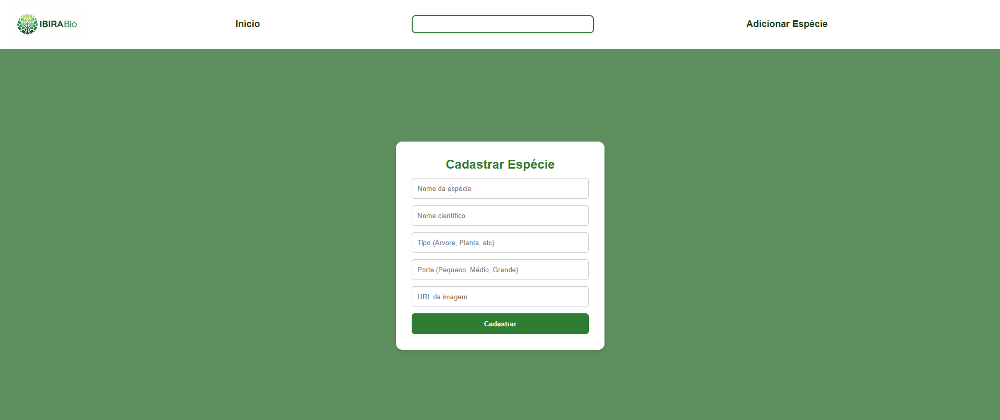
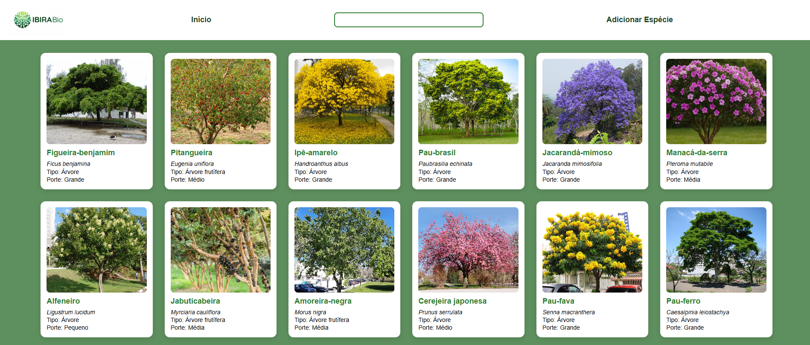

# 🌳 Projeto Biodiversidade - Cadastro de Árvores

Bem-vindo ao **Projeto Biodiversidade**, uma página interativa para cadastro e visualização de espécies de árvores.  
O objetivo é facilitar o registro e a organização de informações sobre a flora local, ajudando na conservação da biodiversidade.

---

## 🔹 Funcionalidades

- Visualizar todas as árvores cadastradas em cards com imagem, nome comum, nome científico, tipo e porte.
- Adicionar novas espécies através de um formulário simples.
- Pesquisa rápida de árvores pelo nome.

---

## 🖥️ Como Usar

1. Abra o arquivo `index.html` no navegador.
2. Para adicionar uma nova árvore, clique em **Adicionar Espécie** e preencha o formulário.
3. As árvores cadastradas aparecerão na página principal em cards organizados.

---

## 📸 Capturas de Tela

  

---

## ⚙️ Tecnologias Usadas

- HTML5
- CSS3
- JavaScript puro
- Backend em Spring Boot (Publicado em Railway)

---

## 🔗 Acesso

O front-end está pronto para ser publicado no GitHub Pages, Netlify ou Vercel.  
Exemplo de link:  
[https://ibira-bio.vercel.app/index.html](https://ibira-bio.vercel.app/index.html)

---

## 👨‍💻 Autor

**Luigi Barros Rechinelli**
